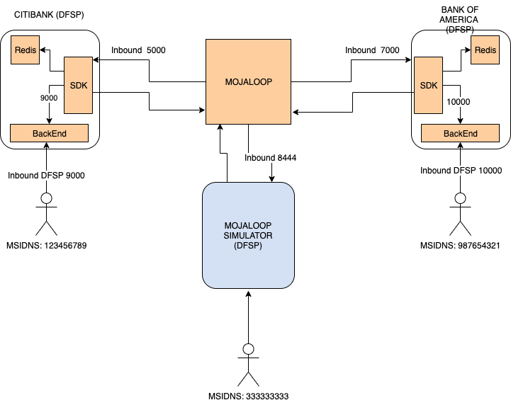

# Local Mojaloop + Custom DFSP Test setup

The aim of this Document is to have a local mojaloop running with two customs DFSPs (backend plus sdk-adapter) and a mojaloop simulator (which implements mojaloop api) as shown in

.


## Create host

* Add to /etc/hosts
```
127.0.0.1       central-ledger.local central-settlement.local ml-api-adapter.local account-lookup-service.local account-lookup-service-admin.local quoting-service.local moja-simulator.local central-ledger central-settlement ml-api-adapter account-lookup-service account-lookup-service-admin quoting-service simulator host.docker.internal
```

## Start the compose

* Run this command

```
docker-compose up
```

We need to check if account-services is running for that reason we'll execute this health request

```
curl -X GET http://account-lookup-service:4002/health
```

If this response is "OK", we can continue with the next step otherwise we need to down this service and start it again

```
docker-compose stop  account-lookup-service
```

```
docker-compose start  account-lookup-service
```


## Create some initial data

### Prerequisites

* Install newman

```
npm install -g newman
```

* cd to the postman folder

```
sh scripts/setupDockerCompose-HubAccount.sh
```

```
OSS-New-Deployment-FSP-Setup

❏ Hub Account
↳ Add Hub Account-HUB_MULTILATERAL_SETTLEMENT
  POST http://central-ledger.local:3001/participants/Hub/accounts [201 Created, 511B, 6.2s]
  ✓  Status code is 201

↳ Add Hub Account-HUB_RECONCILIATION
  POST http://central-ledger.local:3001/participants/Hub/accounts [201 Created, 654B, 78ms]
  ✓  Status code is 201

↳ Hub Set Endpoint-SETTLEMENT_TRANSFER_POSITION_CHANGE_EMAIL Copy
  POST http://central-ledger.local:3001/participants/hub/endpoints [201 Created, 129B, 29ms]
  ✓  Status code is 201

↳ Hub Set Endpoint-NET_DEBIT_CAP_ADJUSTMENT_EMAIL Copy
  POST http://central-ledger.local:3001/participants/hub/endpoints [201 Created, 129B, 35ms]
  ✓  Status code is 201

↳ Hub Endpoint-NET_DEBIT_CAP_THRESHOLD_BREACH_EMAIL Copy
  POST http://central-ledger.local:3001/participants/Hub/endpoints [201 Created, 129B, 38ms]
  ✓  Status code is 201

┌─────────────────────────┬────────────────────┬───────────────────┐
│                         │           executed │            failed │
├─────────────────────────┼────────────────────┼───────────────────┤
│              iterations │                  1 │                 0 │
├─────────────────────────┼────────────────────┼───────────────────┤
│                requests │                  5 │                 0 │
├─────────────────────────┼────────────────────┼───────────────────┤
│            test-scripts │                 10 │                 0 │
├─────────────────────────┼────────────────────┼───────────────────┤
│      prerequest-scripts │                  5 │                 0 │
├─────────────────────────┼────────────────────┼───────────────────┤
│              assertions │                  5 │                 0 │
├─────────────────────────┴────────────────────┴───────────────────┤
│ total run duration: 17.2s                                        │
├──────────────────────────────────────────────────────────────────┤
│ total data received: 809B (approx)                               │
├──────────────────────────────────────────────────────────────────┤
│ average response time: 1278ms [min: 29ms, max: 6.2s, s.d.: 2.5s] │
└──────────────────────────────────────────────────────────────────┘
```

```
sh scripts/setupDockerCompose-OracleOnboarding.sh
```

```
OSS-New-Deployment-FSP-Setup

❏ Oracle Onboarding
↳ Register Simulator Oracle for MSISDN
  POST http://account-lookup-service-admin.local:4001/oracles [201 Created, 213B, 5.2s]

┌─────────────────────────┬──────────────────┬──────────────────┐
│                         │         executed │           failed │
├─────────────────────────┼──────────────────┼──────────────────┤
│              iterations │                1 │                0 │
├─────────────────────────┼──────────────────┼──────────────────┤
│                requests │                1 │                0 │
├─────────────────────────┼──────────────────┼──────────────────┤
│            test-scripts │                1 │                0 │
├─────────────────────────┼──────────────────┼──────────────────┤
│      prerequest-scripts │                1 │                0 │
├─────────────────────────┼──────────────────┼──────────────────┤
│              assertions │                0 │                0 │
├─────────────────────────┴──────────────────┴──────────────────┤
│ total run duration: 7.5s                                      │
├───────────────────────────────────────────────────────────────┤
│ total data received: 0B (approx)                              │
├───────────────────────────────────────────────────────────────┤
│ average response time: 5.2s [min: 5.2s, max: 5.2s, s.d.: 0µs] │
```


### Create a CitiBank DFSP (use SDK + backend)

It will create a new participant with its endpoints and some init data. For this case, name, position, and limits will be

| Parameter | Value |
|-----------|---------|
| `name`       | `citibank`  |
| `currency`       | `USD`  |
| `limit.type`       | `NET_DEBIT_CAP` |
| `limit.value`   | `1000000` |
| `initialPosition`     | `0` |`

```
$ sh scripts/setupDockerCompose-DFSP-CITIBANK.sh`
```

### Create a Bank Of America DFSP (use SDK + backend)

It will create a new participant with its endpoints and some init data. For this case, name, position, and limits will be

| Parameter | Value |
|-----------|---------|
| `name`       | `bankofamerica`  |
| `currency`       | `USD`  |
| `limit.type`       | `NET_DEBIT_CAP` |
| `limit.value`   | `1000000` |
| `initialPosition`     | `0` |`

```
$ sh scripts/setupDockerCompose-DFSP-BANK-OF-AMERICA.sh
```

### Create a Simulator DFSP (implement mojaloop api)

It will create a new participant with its endpoints and some init data. For this case, name, position, and limits will be

| Parameter | Value |
|-----------|---------|
| `name`       | `payeefsp`  |
| `currency`       | `USD`  |
| `limit.type`       | `NET_DEBIT_CAP` |
| `limit.value`   | `1000000` |
| `initialPosition`     | `0` |`

```
$ sh scripts/setupDockerCompose-DFSP-SIMULATOR.sh
```

### Add MSISDN (123456789) for CitiBank DFSP

Register a new MSISDN for this dfsp with this initial data

| Parameter | Value |
|-----------|---------|
| `currency`       | `USD`  |


```
$ sh scripts/setupDockerCompose-DFSP-CITIBANK-MSISDN.sh
```

### Add MSISDN (987654321) for Bank Of America DFSP

Register a new MSISDN for this dfsp with this initial data

| Parameter | Value |
|-----------|---------|
| `currency`       | `USD`  |

```
$ sh scripts/setupDockerCompose-DFSP-BANK-OF-AMERICA-MSISDN.sh
```

### Add MSISDN (333333333) for Simulator

Register a new MSISDN for this dfsp with this initial data

| Parameter | Value |
|-----------|---------|
| `currency`       | `USD`  |

```
$ sh scripts/setupDockerCompose-DFSP-SIMULATOR-MSISDN.sh
```

## Examples

* Transfer USD 100 from MSIDNS 123456789 (CITIBANK) to MSIDNS 987654321 (Bank Of America)

```
curl -v -X POST http://localhost:9000/send   -H 'Content-Type: application/json'  -d '{
    "from": {
        "displayName": "Livia",
        "idType": "MSISDN",
        "idValue": "123456789"
    },
    "to": {
        "idType": "MSISDN",
        "idValue": "987654321"
    },
    "amountType": "SEND",
    "currency": "USD",
    "amount": "100",
    "transactionType": "TRANSFER",
    "note": "test",
    "homeTransactionId": "123ABC"
}'
```

### Response: Transfer was completed
```

{
"from":{
    "displayName":"Livia",
    "idType":"MSISDN",
    "idValue":"123456789"
    },
"to":{
    "idType":"MSISDN",
    "idValue":"987654321",
    "fspId":"bankofamerica",
    "firstName":"Jane",
    "middleName":"Someone",
    "lastName":"Doe",
    "dateOfBirth":"1982-02-02"
    },
"amountType":"SEND",
"currency":"USD",
"amount":"100",
"transactionType":"TRANSFER",
"note":"test",
"homeTransactionId":"123ABC",
"transferId":"7f1f85e7-7da0-430d-ba85-d80ccaf79840",
"currentState":"COMPLETED",
"quoteId":"e9d492eb-92b3-48fd-99b7-7e5674744c3a",
"quoteResponse":{
    "transferAmount":{
        "amount":"100",
        "currency":"USD"
    },
    "expiration":"2019-12-17T17:45:17.042Z",
    "ilpPacket":"AYIDKAAAAAAAACcQIGcuYmFua29mYW1lcmljYS5tc2lzZG4uOTg3NjU0MzIxggL7ZXlKMGNtRnVjMkZqZEdsdmJrbGtJam9pTjJZeFpqZzFaVGN0TjJSaE1DMDBNekJrTFdKaE9EVXRaRGd3WTJOaFpqYzVPRFF3SWl3aWNYVnZkR1ZKWkNJNkltVTVaRFE1TW1WaUxUa3lZak10TkRobVpDMDVPV0kzTFRkbE5UWTNORGMwTkdNellTSXNJbkJoZVdWbElqcDdJbkJoY25SNVNXUkpibVp2SWpwN0luQmhjblI1U1dSVWVYQmxJam9pVFZOSlUwUk9JaXdpY0dGeWRIbEpaR1Z1ZEdsbWFXVnlJam9pT1RnM05qVTBNekl4SWl3aVpuTndTV1FpT2lKaVlXNXJiMlpoYldWeWFXTmhJbjBzSW5CbGNuTnZibUZzU1c1bWJ5STZleUpqYjIxd2JHVjRUbUZ0WlNJNmV5Sm1hWEp6ZEU1aGJXVWlPaUpLWVc1bElpd2liV2xrWkd4bFRtRnRaU0k2SWxOdmJXVnZibVVpTENKc1lYTjBUbUZ0WlNJNklrUnZaU0o5TENKa1lYUmxUMlpDYVhKMGFDSTZJakU1T0RJdE1ESXRNRElpZlgwc0luQmhlV1Z5SWpwN0luQmhjblI1U1dSSmJtWnZJanA3SW5CaGNuUjVTV1JVZVhCbElqb2lUVk5KVTBST0lpd2ljR0Z5ZEhsSlpHVnVkR2xtYVdWeUlqb2lNVEl6TkRVMk56ZzVJaXdpWm5Od1NXUWlPaUpqYVhScFltRnVheUo5TENKdVlXMWxJam9pVEdsMmFXRWlmU3dpWVcxdmRXNTBJanA3SW1GdGIzVnVkQ0k2SWpFd01DSXNJbU4xY25KbGJtTjVJam9pVlZORUluMHNJblJ5WVc1ellXTjBhVzl1Vkhsd1pTSTZleUp6WTJWdVlYSnBieUk2SWxSU1FVNVRSa1ZTSWl3aWFXNXBkR2xoZEc5eUlqb2lVRUZaUlZJaUxDSnBibWwwYVdGMGIzSlVlWEJsSWpvaVEwOU9VMVZOUlZJaWZYMAA",
    "condition":"wxgE2D0ZUPadTLZXcKUsn4soQXiQewAhIGLFbbYFofo",
    "payeeReceiveAmount":{
        "amount":"100",
        "currency":"USD"
    }
},
"quoteResponseSource":"bankofamerica",
"fulfil":{
    "completedTimestamp":"2019-12-17T17:45:19.962Z",
    "transferState":"COMMITTED",
    "fulfilment":"gUTziN47GOZ5kdZ1itVKlSUhaIWmSJ_HBUprJSrVKSI"
    }
}

```

* Transfer USD 90 from MSIDNS 123456789 (CITIBANK) to MSIDNS 333333333 (Simulator)

```
curl -v -X POST http://localhost:10000/send   -H 'Content-Type: application/json'  -d '{
    "from": {
        "displayName": "Livia",
        "idType": "MSISDN",
        "idValue": "123456789"
    },
    "to": {
        "idType": "MSISDN",
        "idValue": "333333333"
    },
    "amountType": "SEND",
    "currency": "USD",
    "amount": "90",
    "transactionType": "TRANSFER",
    "note": "test",
    "homeTransactionId": "123ABC"
}'
```